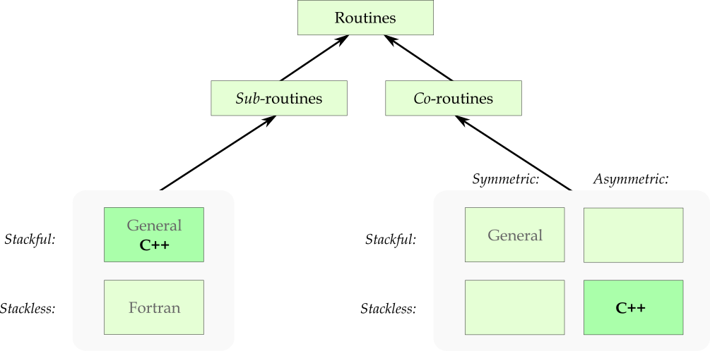

# C++20 stackless coroutines.

<!-- START doctoc generated TOC please keep comment here to allow auto update -->
<!-- DON'T EDIT THIS SECTION, INSTEAD RE-RUN doctoc TO UPDATE -->
**Table of Contents**  *generated with [DocToc](https://github.com/thlorenz/doctoc)*

- [1. General concepts.](#1-general-concepts)
  - [1.1. Stackful versus stackless subroutines.](#11-stackful-versus-stackless-subroutines)
  - [1.2 Stackful versus stackless and symmetric versus asymmetric coroutines.](#12-stackful-versus-stackless-and-symmetric-versus-asymmetric-coroutines)
  - [1.3 Costs of stackless coroutines.](#13-costs-of-stackless-coroutines)
- [2. My perspective.](#2-my-perspective)
- [3. Coroutines as *in-charge* directors (with a working example).](#3-coroutines-as-in-charge-directors-with-a-working-example)
- [4. Alternatives to coroutines for sequence production + consumption.](#4-alternatives-to-coroutines-for-sequence-production--consumption)
  - [4.1. The producing code as a function that produces a collection of values.](#41-the-producing-code-as-a-function-that-produces-a-collection-of-values)
  - [4.2. Inlining a coroutine’s code, suitably reworked, at the point or points where it’s used.](#42-inlining-a-coroutines-code-suitably-reworked-at-the-point-or-points-where-its-used)
  - [4.3. Replacing the stateful sequence production with a mathematical formula.](#43-replacing-the-stateful-sequence-production-with-a-mathematical-formula)
  - [4.4. Expressing the producing code as an object that on demand produces the next value.](#44-expressing-the-producing-code-as-an-object-that-on-demand-produces-the-next-value)
  - [4.5. Expressing the consuming code as an object that when ordered consumes a specified value.](#45-expressing-the-consuming-code-as-an-object-that-when-ordered-consumes-a-specified-value)

<!-- END doctoc generated TOC please keep comment here to allow auto update -->

## 1. General concepts.

From a practical-use perspective *co*routines and *sub*routines are the two main kinds of *routines*, as the terms imply.

<sub><sup>Heads up: this differs from an unnatural & for C++ programming impractical academic perspective that you’ll find in e.g. Wikipedia, where subroutines are considered to be a special case of coroutines.</sup></sub>

A **routine** is known as a “function” in C++. It’s a usually named and often parameterized specification of a sequence of actions + a set of local variables. In each **instance** of a routine the routine’s code refers to that instance’s unique set of parameter and local variable instances. With a general **subroutine** a request to execute the routine, a **call**, results in (1) creation of an instance, (2) execution of the instance’s sequence of actions, and (3) destruction of the instance, whence execution resumes at the point after the call. I.e. the sub-routine’s execution is *sub*ordinate to, nested in, the calling code’s execution.

In contrast, with a general **coroutine** there is no request to execute the routine but instead (1) an instance is created; (2.1) execution is then **transferred** to the coroutine instance; and unless it finishes now, at some point it will (2.2) transfer execution out to another coroutine, which resumes that coroutine’s execution, which (2.3) might transfer execution back to the first one, and (2.4, 2.5, … 2.*n*) so on. A coroutine instance’s local variables keep on existing (3) until the execution is finished, usually after multiple transfers elsewhere and back. I.e. with a co-routine instance its execution *co*exists with the execution of other coroutine instances, possibly including the execution of other instances of the same coroutine (which is not the same as recursion).

&nbsp;&nbsp;&nbsp;&nbsp;

### 1.1. Stackful versus stackless subroutines.

For subroutines **stackful** means that a subroutine can call itself directly or indirectly, i.e. recursion, thus creating lifetime-nested instances. The lifetime-nesting requires/implies a stack of instances and execution return addresses in each thread of execution, and is the only kind of subroutine in C++. In contrast the default kind of subroutine in Fortran, and the only kind in Fortran 77, is **stackless**, essentially with a single return address location associated with each subroutine, which rules out (well-defined) recursive calls.

Coding something in a non-recursive way, compatible with stackless routines, can add much complexity.

For [example](code/sections/general%20concepts/stackful-vs-stackless-bst-traversal.cpp), compared to this recursive infix BST traversal which *requires a stackful subroutine*:

~~~cpp
void recursive_for_each(
    const_<Node*>               root,
    in_<function<void(int)>>    consume
    )
{
    if( root ) {
        recursive_for_each( root->left, consume );
        consume( root->value );
        recursive_for_each( root->right, consume );
    }
}
~~~


&hellip; an iterative infix BST traversal that *works also with a stackless subroutine* is much more and more complex code:

~~~cpp
void iterative_for_each(
    const_<Node*>               root,
    in_<function<void(int)>>    consume
    )
{
    if( not root ) { return; }
    enum class Heading{ down, up_from_left, up_from_right };
    auto    heading     = Heading::down;
    auto    current     = a_<Node*>( root );
    auto    parents     = stack<Node*>();
    for( ;; ) {
        switch( heading ) {
            case Heading::down: {
                if( current->left ) {
                    parents.push( current );
                    current = current->left;
                } else {
                    heading = Heading::up_from_left;
                }
                break;
            }
            case Heading::up_from_left: {
                consume( current->value );
                if( current->right ) {
                    parents.push( current );
                    current = current->right;
                    heading = Heading::down;
                } else {
                    heading = Heading::up_from_right;
                }
                break;
            }
            case Heading::up_from_right: {
                if( is_empty( parents ) ) {
                    return;
                } else {
                    const auto parent = a_<Node*>( popped_top_of( parents ) );
                    heading = (current == parent->left?
                        Heading::up_from_left : Heading::up_from_right
                        );
                    current = parent;
                }
                break;
            }
        }
    }
}
~~~

Since in the above example the problem is of a recursive nature the recursive function, which needs to be stackful, is very much shorter, simpler and clear, and thus would ideally be the way to express this. However, in practice a C++ call stack is of *very limited* size, e.g. 1 MB by default with Visual C++, so it suffers from a possibility of stack overflow. The complex iterative code, which can be a stackless routine, avoids that problem.

---
### 1.2 Stackful versus stackless and symmetric versus asymmetric coroutines.

A **stackful coroutine** is one that can call a subroutine and transfer out somewhere within that call.

For example, an in-order iteration over a binary tree, handing out iterator values suitable for a range based `for` in C++, could be easily expressed via a general coroutine calling a recursive traversal subroutine like `recursive_for_each` above, and transferring out from within its recursive calls. The coroutine instance’s call stack then serves to remember the path down from the tree’s root to the current iteration position. This requires *one stack per coroutine instance*.

Because of that multi-stack requirement general coroutines would in many use cases be *in conflict with the C++ ideal of not paying significantly for what you don’t use*.

That’s especially so when conventional contiguous memory stacks based are used. Linked list stacks are technically possible, but even size-optimized linked list stacks can affect performance by scattering memory accesses in a cache-unfriendly way. And so C++20 only supports a limited kind of coroutines called **stackless coroutine**s.

A stackless coroutine transfer, expressed with keyword `co_await`, `co_yield` or `co_return`, must be *directly in the coroutine’s own code*.

The subroutine calls that these coroutines make can have possibly long call chains until the execution returns back up to the next transfer. But when it gets back up to a point of control transfer the stack depth is limited to a very small value known at compile time, which means that all coroutine instances in a thread of execution can share that thread’s single common stack for their arbitrarily stack hungry subroutine calls. So they’re not entirely stackless — that term is to some degree a misnomer — but for their own internal code execution they use a very small fixed size stack, and for subroutine calls they share a common stack.

Recall that the general notion of coroutines is of stackful, **symmetric** coroutines. With symmetric coroutines each transfer specifies, directly or indirectly, the coroutine that should resume execution; the transfers are between coroutines. In contrast, with **asymmetric** coroutines a transfer to a coroutine comes from some top level control, and a transfer out from a coroutine is back up from the coroutine to the top level control, which can then transfer down to another coroutine and resume that, and so on. And C++20 coroutines are not just limited to stackless. They’re also limited to asymmetric, which unfortunately leads to speaking about transfers — e.g. cppreference does this — as **calls** and **returns**, even though this is very unlike subroutine calls and returns.

One way to visualize the general notion of coroutine execution is that:

* In each thread there is a plane of coroutine instances spread about.
* At any point in time down from each coroutine instance extends a chain of subroutine calls, with every chain except the one that’s currently executing, ending in a transfer away from that chain’s coroutine instance.
* These out-transfer points at the ends of the call chains are also the points where execution later will resume when these coroutine instances are transferred to.

The difference with assymetric coroutines is that instead of a web of possible transfers between the coroutine instances, there are possible transfers from/to each coroutine instance up to a top level control above the coroutine plane, e.g. a C++ `main`.

The (independent) difference with stackless couroutines is that at any time there extends down a chain of subroutine calls from *just one of the coroutine instances*, namely the one currently executing.

### 1.3 Costs of stackless coroutines.

Stackless coroutines is a nice and simple idea  that saves on memory, but TANSTAAFL: *there ain’t no such thing as a free lunch*.

One main cost of this memory usage efficiency is that it’s **hard to provide any safe abstraction** on top of C++ coroutine transfers, because the `co_await`, `co_yield` or `co_return` can’t be wrapped. In particular a template pattern abstraction can’t be used for a coroutine’s code, if it would wrap one of the these keywords. It seems that only the approach of code preprocessing remains.

A second cost is added **complexity** and hence code fragility. First of all this occurs when some naturally recursive logic has to be expressed iteratively to be compatible with stacklessness, as illustrated earlier by the `iterative_for_each` function. But it also occurs when one delves down to the “API” level of C++20 coroutines in order to customize things.

---

## 2. My perspective.

I’m writing this as I’m *teaching myself* about C++20 stackless coroutines. I’m no stranger to general coroutines, though: I first learned the basic notions without having a name for them, in assembly programming in college in the early 1980’s; then I became familiar with proper language support for coroutines in Modula-2 in the late 1980’s; and then in the mid 1990’s I implemented some simple coroutine support in C++ with some added assembly. I later learned that my approach then, using `setjmp`, was really dangerous and error prone, but happily I had cautioned my single known library (or example program? I don’t recall) user who probably, hopefully, just used the code as an example and starting point.

For documentation I’m using the info and examples at [cppreference.com](https://en.cppreference.com/w/cpp/language/coroutines).

So far my impression is that C++20 stackless coroutines are seemingly designed for and possible to employ for some specific use cases such as generating a sequence of values that can be consumed by a range based `for`, and that otherwise, for other things, insane complexity kicks in.

---

## 3. Coroutines as *in-charge* directors (with a working example).

A natural way to produce a sequence of integer values is via an indexing `for` loop:

```cpp
int sum = 0;
for( int i = 1; i <= n; ++i ) {
    sum += i;
    do_something_with( sum );
}
```

And a natural way to consume such a sequence, e.g. to add the numbers, is via a range based `for` loop:

```cpp
    int sum = 0;
    for( const int v: numbers( 7 ) ) { sum += v; }
    printf( "%d\n", sum );
```

As a super-short analysis: the first code snippet invoked with `n` = 7 produces the sums 1, 3, 6, 10, 15, 21 and 28, known as triangular numbers, and the second code snippet — if somehow the first snippet’s `do_something_with` could be joined with this snippet’s `numbers(7)` — then outputs 1 + 3 + 6 + 10 + 15 + 21 + 28 = 84.

The first snippet acts like a subroutine that’s called and during the call, where it’s in complete charge, further calls `do_something_with` a number of times. The second snippet acts like a subroutine that’s called and during the call, where it’s in complete charge, retrieves and processes values from the logical collection `numbers(7)`. This might seem irreconcilable unless one accepts costs such as storing the collection of numbers somewhere, but by definining or using someone else’s support C++20 coroutines let you directly join such apparently irreconcilable ***I’m in charge*** snippets, sort of like a shell pipe.

In the code below the `coroutine::Sequence_<int>` return type is a Do-It-Yourself class that provides necessary support for this way to use coroutines. That part is non-trivial; I discuss it later. Happily C++23 will have/has `std::generator` that does just about the same job but also connects with the ranges sub-library, but even C++23 lacks support for other coroutine use cases.


[*sum-of-sequence.cpp*](code/sections/coroutines%20as%20in-charge%20directors/sum-of-sequence.cpp):
```cpp
#include <cpp_machinery/coroutine/Sequence_.hpp>
#include <stdio.h>
namespace coroutine = cpp_machinery::coroutine;

auto numbers( const int n ) -> coroutine::Sequence_<int>
{
    int sum = 0;
    for( int i = 1; i <= n; ++i ) {
        sum += i;
        co_yield sum;
    }
}

auto main() -> int
{
    int sum = 0;
    for( const int v: numbers( 7 ) ) { sum += v; }
    printf( "%d\n", sum );
}
```

The output is correctly twice the universal answer 42, namely

```txt
84
```

The earlier producer code snippet’s `do_something_with`-call is here replaced with a `co_yield` expression that transfers control back to `main`. As mentioned it wouldn't work to define a subroutine `do_something_with` that issued the `co_yield`. Because then, lacking that keyword, `numbers` would no longer be coroutine but just an ordinary subroutine.

There is no corresponding `co_yield` in `main` or in the code called by `main`, because with C++ stackless coroutines it’s only in a very abstract sense that `main` is a coroutine here. To (repeatedly) transfer control to the corutine, `main` instead indirectly calls *h*`.resume()` where *h* is a handle of the coroutine instance. These indirect calls happen through the iterator operations in the range based `for` loop, with the iterators produced by the `numbers(7)` result.

This means that C++ stackless coroutines, while *co* with each other, are *not on an equal footing* with their “callers” like `main`. The documentation at cppreference talks about “call” and “return”, a very assymetric subroutine-like relationship. A “caller” of a coroutine instance means the top level controlling code that transfers down to it.

Another relevant point: the return type, while constituting necessary helper machinery, doesn’t tell the compiler that this is a coroutine, and so by seeing only the pure declaration of a coroutine *the compiler doesn’t know that it’s a coroutine*. All the special treatment — e.g. that a direct call doesn’t normally enter any of the code in the function body — happens for the possibly separately compiled function definition, and for use of a coroutine handle, and otherwise a coroutine is just an ordinary normal function. It’s the `co_yield` in the routine body that declares “this is a coroutine”.

Third but marginal point: the name `Sequence_` of my DIY function result class indicates *what* the function produces, while the C++23 name `generator` more indicates the *how*, namely that the function works like a [Python generator](https://wiki.python.org/moin/Generators). Possibly helpful if one is familiar with Python. However, note that using a coroutine as a sequence generator is just the ~simplest way to use a coroutine.

---

## 4. Alternatives to coroutines for sequence production + consumption.

Possible ways to write the above example without coroutines include

* expressing the producing code as a function that produces a collection of values, or
* inlining a coroutine’s code, suitably reworked, at the point or points where it’s used, or
* if possible, replacing the stateful sequence production with a pure function, a mathematical formula, or
* expressing the producing code as an object that on demand produces the next value, or
* expressing the consuming code as an object that when ordered consumes a specified value.

The last two points can be done via Do-It-Yourself classes or in some/many cases using C++20 ranges.

For a simple example such as above these rewrites cannot reflect how complex and how much work this can be, but I show and discuss the rewrites because to make an informed choice of whether to use coroutines, one needs to be aware of the design possibilities, the design space.

### 4.1. The producing code as a function that produces a collection of values.

With the producing code rewritten to produce an ordinary collection of values the `main` function logic can be kept literally as-is, no change:

[*sum-of-sequence.re-expressed-1.collection.cpp*](code/sections/alternatives%20to%20coroutines%20for%20sequence%20production%20+%20consumption/sum-of-sequence.re-expressed-1.collection.cpp):

```cpp
#include <vector>
#include <stdio.h>
using std::vector;

auto numbers( const int n ) -> vector<int>
{
    vector<int> result;
    int sum = 0;
    for( int i = 1; i <= n; ++i ) {
        sum += i;
        result.push_back( sum );
    }
    return result;
}

auto main() -> int
{
    int sum = 0;
    for( const int v: numbers( 7 ) ) { sum += v; }
    printf( "%d\n", sum );
}
```

However what happens on the inside of that range based `for` loop is very different than with the coroutine. If the sequence is long enough a gosh-awfully-large amount of memory will be allocated for the collection. And there’s no way that `main` can produce any result until the entire sequence has been produced, which rules out infinite sequences. The coroutine approach handles infinite sequences well, like a pipe. In essence, the function-that-returns-collection is like early MS-DOS pipes, which ran the producer to its end, storing the data in a temporary file, before then running the consumer.

So, in this picture the coroutine approach is the evolutionary step up to Unix-like parallel execution pipes.

### 4.2. Inlining a coroutine’s code, suitably reworked, at the point or points where it’s used.

The idea for the names `s2` and `s3` in this rewrite is that the view of $s_2(i)=s_2(i-1)+i$ (the numbers handed to `co_yield` and obtained from `numbers(7)`) and similarly $s_3(i)=s_3(i-1)+s_2(i)$ (the numbers calculated by the consumer code in `main`) fits the generalization

$$
\begin{aligned}
s_0(i) &= 1 \\
s_k(0) &= 0 \text{ for } k > 0 \\
s_k(i) &= s_k(i-1) + s_{k-1}(i)
\end{aligned}
$$

[*sum-of-sequence.re-expressed-2.inlined.cpp*](code/sections/alternatives%20to%20coroutines%20for%20sequence%20production%20+%20consumption/sum-of-sequence.re-expressed-2.inlined.cpp):

```cpp
#include <stdio.h>
auto main() -> int
{
    int s2 = 0;
    int s3 = 0;
    for( int s1 = 1; s1 <= 7; s1 += 1 ) {
        s2 += s1;
        s3 += s2;
    }
    printf( "%d\n", s3 );
}
```

This is certainly more *efficient* than the coroutine approach, but with other problems it may be opposite.

To my eyes it looks more complex because there’s more visibly going on in a short stretch of code; the coroutine approach is one way to divide it into more easily grokable subproblems.


### 4.3. Replacing the stateful sequence production with a mathematical formula.

In some cases it’s practically possible for an ordinary programmer, one who is not trained as a mathematician, to replace the iterative stateful generation of some sequence with a mathematical formula that calculates the *i*ᵗʰ term directly.

For example, $1 + 2 + 3 + \cdots + n$ can be calculated as *n* times the average of those numbers, i.e.

$$n \cdot  \frac{n + 1}{2} = \frac{1}{2}( n^2 + n )$$

As an example of another common case, since e.g. $10^3 - 1 = 900 + 90 + 9$ and more generally

$$x^n - 1 = (x-1) \cdot \sum_{i=0}^{n-1} {x^i}$$

&hellip; the sum $x^0 + x^1 + x^2 + \cdots + x^{n-1}$ can be calculated as just $(x^n - 1)/(x - 1)$.

The sum that the coroutine example program calculates,

$$\sum_{i = 1}^{n}{\frac{1}{2}(n^2 + n)}$$

&hellip; is more tricky. But googling it I found the formula $\frac{1}{6}n(n+1)(n+2)$. In my experience googling can often find such formulas.

[*sum-of-sequence.re-expressed-3.formula.cpp*](code/sections/alternatives%20to%20coroutines%20for%20sequence%20production%20+%20consumption/sum-of-sequence.re-expressed-3.formula.cpp):

```cpp
#include <stdio.h>
auto main() -> int
{
    const int n = 7;
    printf( "%d\n", n*(n + 1)*(n + 2)/6 );
}
```

Happily this rewrite using a not well understood formula, still produces the correct result 84.

### 4.4. Expressing the producing code as an object that on demand produces the next value.

A Do-It-Yourself class for an object that produces the triangular numbers of the coroutine, can go like this:

[*sum-of-sequence.re-expressed-4.stateful-producer-object.cpp*](code/sections/alternatives%20to%20coroutines%20for%20sequence%20production%20+%20consumption/sum-of-sequence.re-expressed-4.stateful-producer-object.cpp):

```cpp
class Numbers
{
    int     m_n;
    int     m_i;
    int     m_sum;

public:
    Numbers( const int n ): m_n( n ), m_i( 0 ), m_sum( 0 ) { advance(); }
    
    auto current() const        -> int      { return m_sum; }
    auto available() const      -> bool     { return (m_i <= m_n); }

    void advance()
    {
        ++m_i;
        m_sum = (available()? m_sum + m_i : -1);
    }
};

#include <stdio.h>
auto main() -> int
{
    int sum = 0;
    for( Numbers numbers( 7 ); numbers.available(); numbers.advance() ) {
        sum += numbers.current();
    }
    printf( "%d\n", sum );
}
```

A main design issue is the call to `advance()` in the constructor, because for some other problems that **primer call** can be costly. Maybe a `Numbers` instance is just created in order to be handed over to some thread. In that case it would be nice if all time consuming work happened over in that thread.

Instead of that automatic primer call one can then have essentially ~0 construction cost by adding checking in each externally available operation, of whether the object state has been brought up to first value and if not, calling `advance()`, or whatever is necessary.

### 4.5. Expressing the consuming code as an object that when ordered consumes a specified value.

A Do-It-Yourself class that does the work of the `main` loop in the coroutine example, can go like this:

[*sum-of-sequence.re-expressed-5.stateful-consumer-object.cpp*](code/sections/alternatives%20to%20coroutines%20for%20sequence%20production%20+%20consumption/sum-of-sequence.re-expressed-5.stateful-consumer-object.cpp):

```cpp
class Consumer
{
    int     m_sum   = 0;

public:
    void process( const int v ) { m_sum += v; }
    auto result() const -> int { return m_sum; }
};

#include <stdio.h>
auto main() -> int
{
    Consumer consumer;
    int sum = 0;
    for( int i = 1; i <= 7; ++i ) {
        sum += i;
        consumer.process( sum );
    }
    printf( "%d\n", consumer.result() );
}
```

This is the only rewrite that mostly preserves the coroutine code.

So this is the only rewrite that preserves the view of the coroutine code as being *in charge* and *pushing* numbers into the processing logic.

