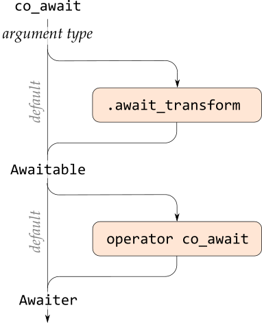

# C++20 stackless coroutines.

<!-- START doctoc generated TOC please keep comment here to allow auto update -->
<!-- DON'T EDIT THIS SECTION, INSTEAD RE-RUN doctoc TO UPDATE -->
**Table of Contents**  *generated with [DocToc](https://github.com/thlorenz/doctoc)*

- [1. General concepts.](#1-general-concepts)
  - [1.1. Stackful versus stackless subroutines.](#11-stackful-versus-stackless-subroutines)
  - [1.2 Stackful versus stackless and symmetric versus asymmetric coroutines.](#12-stackful-versus-stackless-and-symmetric-versus-asymmetric-coroutines)
  - [1.3 Costs of stackless coroutines.](#13-costs-of-stackless-coroutines)
- [2. My perspective.](#2-my-perspective)
- [3. Coroutines as *in-charge* directors (with a working example).](#3-coroutines-as-in-charge-directors-with-a-working-example)
- [4. Alternatives to coroutines for sequence production + consumption.](#4-alternatives-to-coroutines-for-sequence-production--consumption)
  - [4.1. The producing code as a function that produces a collection of values.](#41-the-producing-code-as-a-function-that-produces-a-collection-of-values)
  - [4.2. Inlining a coroutine’s code, suitably reworked, at the point or points where it’s used.](#42-inlining-a-coroutines-code-suitably-reworked-at-the-point-or-points-where-its-used)
  - [4.3. Replacing the stateful sequence production with a mathematical formula.](#43-replacing-the-stateful-sequence-production-with-a-mathematical-formula)
  - [4.4. Expressing the producing code as an object that on demand produces the next value.](#44-expressing-the-producing-code-as-an-object-that-on-demand-produces-the-next-value)
  - [4.5. Expressing the consuming code as an object that when ordered consumes a specified value.](#45-expressing-the-consuming-code-as-an-object-that-when-ordered-consumes-a-specified-value)
- [5. The coroutine API.](#5-the-coroutine-api)
  - [5.1. A coroutine “Hello, world!” using only basics.](#51-a-coroutine-hello-world-using-only-basics)
  - [5.2. A `co_yield` value producer using only basics.](#52-a-co_yield-value-producer-using-only-basics)
  - [5.3. A `co_await` value consumer using only basics.](#53-a-co_await-value-consumer-using-only-basics)
- [6. Synchronization.](#6-synchronization)

<!-- END doctoc generated TOC please keep comment here to allow auto update -->

## 1. General concepts.

From a practical-use perspective *co*routines and *sub*routines are the two main kinds of *routines*, as the terms imply.

<sub><sup>Heads up: this differs from an unnatural & for C++ programming impractical academic perspective that you’ll find in e.g. Wikipedia, where subroutines are considered to be a special case of coroutines.</sup></sub>

A **routine** is known as a “function” in C++. It’s a usually named and often parameterized specification of a sequence of actions + a set of local variables. In each **instance** of a routine the routine’s code refers to that instance’s unique set of parameter and local variable instances. With a general **subroutine** a request to execute the routine, a **call**, results in (1) creation of an instance, (2) execution of the instance’s sequence of actions, and (3) destruction of the instance, whence execution resumes at the point after the call. I.e. the sub-routine’s execution is *sub*ordinate to, nested in, the calling code’s execution.

In contrast, with a general **coroutine** there is no request to execute the routine but instead (1) an instance is created; (2.1) execution is then **transferred** to the coroutine instance; and unless it finishes now, at some point it will (2.2) transfer execution out to another coroutine, which resumes that coroutine’s execution, which (2.3) might transfer execution back to the first one, and (2.4, 2.5, … 2.*n*) so on. A coroutine instance’s local variables keep on existing (3) until the execution is finished, usually after multiple transfers elsewhere and back. I.e. with a co-routine instance its execution *co*exists with the execution of other coroutine instances, possibly including the execution of other instances of the same coroutine (which is not the same as recursion).

&nbsp;&nbsp;&nbsp;&nbsp;

### 1.1. Stackful versus stackless subroutines.

For subroutines **stackful** means that a subroutine can call itself directly or indirectly, i.e. recursion, thus creating lifetime-nested instances. The lifetime-nesting requires/implies a stack of instances and execution return addresses in each thread of execution, and is the only kind of subroutine in C++. In contrast the default kind of subroutine in Fortran, and the only kind in Fortran 77, is **stackless**, essentially with a single return address location associated with each subroutine, which rules out (well-defined) recursive calls.

Coding something in a non-recursive way, compatible with stackless routines, can add much complexity.

For [example](code/sections/general%20concepts/stackful-vs-stackless-bst-traversal.cpp), compared to this recursive infix BST traversal which *requires a stackful subroutine*:

~~~cpp
void recursive_for_each(
    const_<Node*>               root,
    in_<function<void(int)>>    consume
    )
{
    if( root ) {
        recursive_for_each( root->left, consume );
        consume( root->value );
        recursive_for_each( root->right, consume );
    }
}
~~~


&hellip; an iterative infix BST traversal that *works also with a stackless subroutine* is much more and more complex code:

~~~cpp
void iterative_for_each(
    const_<Node*>               root,
    in_<function<void(int)>>    consume
    )
{
    if( not root ) { return; }
    enum class Heading{ down, up_from_left, up_from_right };
    auto    heading     = Heading::down;
    auto    current     = a_<Node*>( root );
    auto    parents     = stack<Node*>();
    for( ;; ) {
        switch( heading ) {
            case Heading::down: {
                if( current->left ) {
                    parents.push( current );
                    current = current->left;
                } else {
                    heading = Heading::up_from_left;
                }
                break;
            }
            case Heading::up_from_left: {
                consume( current->value );
                if( current->right ) {
                    parents.push( current );
                    current = current->right;
                    heading = Heading::down;
                } else {
                    heading = Heading::up_from_right;
                }
                break;
            }
            case Heading::up_from_right: {
                if( is_empty( parents ) ) {
                    return;
                } else {
                    const auto parent = a_<Node*>( popped_top_of( parents ) );
                    heading = (current == parent->left?
                        Heading::up_from_left : Heading::up_from_right
                        );
                    current = parent;
                }
                break;
            }
        }
    }
}
~~~

Since in the above example the problem is of a recursive nature the recursive function, which needs to be stackful, is very much shorter, simpler and clear, and thus would ideally be the way to express this. However, in practice a C++ call stack is of *very limited* size, e.g. 1 MB by default with Visual C++, so it suffers from a possibility of stack overflow. The complex iterative code, which can be a stackless routine, avoids that problem.

---
### 1.2 Stackful versus stackless and symmetric versus asymmetric coroutines.

A **stackful coroutine** is one that can call a subroutine and transfer out somewhere within that call.

For example, an in-order iteration over a binary tree, handing out iterator values suitable for a range based `for` in C++, could be easily expressed via a general coroutine calling a recursive traversal subroutine like `recursive_for_each` above, and transferring out from within its recursive calls. The coroutine instance’s call stack then serves to remember the path down from the tree’s root to the current iteration position. This requires *one stack per coroutine instance*.

Because of that multi-stack requirement general coroutines would in many use cases be *in conflict with the C++ ideal of not paying significantly for what you don’t use*.

That’s especially so when conventional contiguous memory stacks based are used. Linked list stacks are technically possible, but even size-optimized linked list stacks can affect performance by scattering memory accesses in a cache-unfriendly way. And so C++20 only supports a limited kind of coroutines called **stackless coroutine**s.

A stackless coroutine transfer, expressed with keyword `co_await`, `co_yield` or `co_return`, must be *directly in the coroutine’s own code*.

The subroutine calls that these coroutines make can have possibly long call chains until the execution returns back up to the next transfer. But when it gets back up to a point of control transfer the stack depth is limited to a very small value known at compile time, which means that all coroutine instances in a thread of execution can share that thread’s single common stack for their arbitrarily stack hungry subroutine calls. So they’re not entirely stackless — that term is to some degree a misnomer — but for their own internal code execution they use a very small capacity stack, and for subroutine calls they share a common stack.

Recall that the general notion of coroutines is of stackful, **symmetric** coroutines. With symmetric coroutines each transfer specifies, directly or indirectly, the coroutine that should resume execution; the transfers are between coroutines. In contrast, with **asymmetric** coroutines a transfer to a coroutine comes from some top level control, and a transfer out from a coroutine is back up from the coroutine to the top level control, which can then transfer down to another coroutine and resume that, and so on.

C++20 coroutines are easiest to use as asymmetric coroutines; stackless, asymmetric coroutines. This unfortunately leads to speaking about transfers — e.g. cppreference does this — as **calls** and **returns**, even though this is very unlike subroutine calls and returns. However, they apparently also support symmetric coroutine transfers, i.e. transfers directly between coroutines.

One way to visualize the general notion of coroutine execution is that:

* In each thread there is a plane of coroutine instances spread about.
* At any point in time down from each coroutine instance extends a chain of subroutine calls, with every chain except the one that’s currently executing, ending in a transfer away from that chain’s coroutine instance.
* These out-transfer points at the ends of the call chains are also the points where execution later will resume when these coroutine instances are transferred to.

The difference with assymetric coroutines is that instead of a web of possible transfers between the coroutine instances, there are possible transfers from/to each coroutine instance up to a top level control above the coroutine plane, e.g. a C++ `main`.

The (independent) difference with stackless couroutines is that at any time there extends down a chain of subroutine calls from *just one of the coroutine instances*, namely the one currently executing.

### 1.3 Costs of stackless coroutines.

Stackless coroutines is a nice and simple idea  that saves on memory, but TANSTAAFL: *there ain’t no such thing as a free lunch*.

One main cost of this memory usage efficiency is that it’s **hard to provide any safe abstraction** on top of C++ coroutine transfers, because the `co_await`, `co_yield` or `co_return` can’t be wrapped. In particular a template pattern abstraction can’t be used for a coroutine’s code, if it would wrap one of the these keywords. It seems that only the approach of code preprocessing remains.

A second cost is added **complexity** and hence code fragility. First of all this occurs when some naturally recursive logic has to be expressed iteratively to be compatible with stacklessness, as illustrated earlier by the `iterative_for_each` function. But it also occurs when one delves down to the “API” level of C++20 coroutines in order to customize things.

---

## 2. My perspective.

I’m writing this as I’m *teaching myself* about C++20 stackless coroutines. I’m no stranger to general coroutines, though: I first learned the basic notions without having a name for them, in assembly programming in college in the early 1980’s; then I became familiar with proper language support for coroutines in Modula-2 in the late 1980’s; and then in the mid 1990’s I implemented some simple coroutine support in C++ with some added assembly. I later learned that my approach then, using `setjmp`, was really dangerous and error prone, but happily I had cautioned my single known library (or example program? I don’t recall) user who probably, hopefully, just used the code as an example and starting point.

For documentation I’m using the info and examples at [cppreference.com](https://en.cppreference.com/w/cpp/language/coroutines).

So far my impression is that C++20 stackless coroutines are seemingly designed for and possible to employ for some specific use cases such as generating a sequence of values that can be consumed by a range based `for`, and that otherwise, for other things, insane complexity kicks in.

---

## 3. Coroutines as *in-charge* directors (with a working example).

A natural way to produce a sequence of integer values is via an indexing `for` loop:

```cpp
int sum = 0;
for( int i = 1; i <= n; ++i ) {
    sum += i;
    do_something_with( sum );
}
```

And a natural way to consume such a sequence, e.g. to add the numbers, is via a range based `for` loop:

```cpp
    int sum = 0;
    for( const int v: numbers( 7 ) ) { sum += v; }
    printf( "%d\n", sum );
```

As a super-short analysis: the first code snippet invoked with `n` = 7 produces the sums 1, 3, 6, 10, 15, 21 and 28, known as triangular numbers, and the second code snippet — if somehow the first snippet’s `do_something_with` could be joined with this snippet’s `numbers(7)` — then outputs 1 + 3 + 6 + 10 + 15 + 21 + 28 = 84.

The first snippet acts like a subroutine that’s called and during the call, where it’s in complete charge, further calls `do_something_with` a number of times. The second snippet acts like a subroutine that’s called and during the call, where it’s in complete charge, retrieves and processes values from the logical collection `numbers(7)`. This might seem irreconcilable unless one accepts costs such as storing the collection of numbers somewhere, but by definining or using someone else’s support C++20 coroutines let you directly join such apparently irreconcilable ***I’m in charge*** snippets, sort of like a shell pipe.

In the code below the `coroutine::Sequence_<int>` return type is a Do-It-Yourself class that provides necessary support for this way to use coroutines. That part is non-trivial; I discuss it later. Happily C++23 will have/has `std::generator` that does just about the same job but also connects with the ranges sub-library, but even C++23 lacks support for other coroutine use cases.


[*sum-of-sequence.cpp*](code/sections/coroutines%20as%20in-charge%20directors/sum-of-sequence.cpp):
```cpp
#include <cpp_machinery/coroutine/Sequence_.hpp>
#include <stdio.h>
namespace coroutine = cpp_machinery::coroutine;

auto numbers( const int n ) -> coroutine::Sequence_<int>
{
    int sum = 0;
    for( int i = 1; i <= n; ++i ) {
        sum += i;
        co_yield sum;
    }
}

auto main() -> int
{
    int sum = 0;
    for( const int v: numbers( 7 ) ) { sum += v; }
    printf( "%d\n", sum );
}
```

The output is correctly twice the universal answer 42, namely

```txt
84
```

The earlier producer code snippet’s `do_something_with`-call is here replaced with a `co_yield` expression that transfers control back to `main`. As mentioned it wouldn't work to define a subroutine `do_something_with` that issued the `co_yield`. Because then, lacking that keyword, `numbers` would no longer be a coroutine but just an ordinary subroutine, and `do_something_with` would then become a coroutine where each apparent call from `numbers` would just create and discard a coroutine instance.

There is no corresponding `co_yield` in `main` or in the code called by `main`, because with C++ stackless coroutines it’s only in a very abstract sense that `main` is a coroutine here. To (repeatedly) transfer control to the corutine, `main` instead indirectly calls *h*`.resume()` where *h* is a handle of the coroutine instance. These indirect calls happen through the iterator operations in the range based `for` loop, with the iterators produced by the `numbers(7)` result.

This means that C++ stackless coroutines, while *co* with each other, are *not on an equal footing* with their “callers” like `main`. The documentation at cppreference talks about “call” and “return”, a very assymetric subroutine-like relationship. A “caller” of a coroutine instance means the top level controlling code that transfers down to it.

Another relevant point: the return type, while constituting necessary helper machinery, doesn’t tell the compiler that this is a coroutine, and so by seeing only the pure declaration of a coroutine *the compiler doesn’t know that it’s a coroutine*. All the special treatment — e.g. that a direct call doesn’t normally enter any of the code in the function body — happens for the possibly separately compiled function definition, and for use of a coroutine handle, and otherwise a coroutine is just an ordinary normal function. It’s the `co_yield` in the routine body that declares “this is a coroutine”.

Third but marginal point: the name `Sequence_` of my DIY function result class indicates *what* the function produces, while the C++23 name `generator` more indicates the *how*, namely that the function works like a [Python generator](https://wiki.python.org/moin/Generators). Possibly helpful if one is familiar with Python. However, note that using a coroutine as a sequence generator is just the ~simplest way to use a coroutine.

---

## 4. Alternatives to coroutines for sequence production + consumption.

Possible ways to write the above example without coroutines include

* expressing the producing code as a function that produces a collection of values, or
* inlining a coroutine’s code, suitably reworked, at the point or points where it’s used, or
* if possible, replacing the stateful sequence production with a pure function, a mathematical formula, or
* expressing the producing code as an object that on demand produces the next value, or
* expressing the consuming code as an object that when ordered consumes a specified value.

The last two points can be done via Do-It-Yourself classes or in some/many cases using C++20 ranges.

For a simple example such as above these rewrites cannot reflect how complex and how much work this can be, but I show and discuss the rewrites because to make an informed choice of whether to use coroutines, one needs to be aware of the design possibilities, the design space.

### 4.1. The producing code as a function that produces a collection of values.

With the producing code rewritten to produce an ordinary collection of values the `main` function logic can be kept literally as-is, no change:

[*sum-of-sequence.re-expressed-1.collection.cpp*](code/sections/alternatives%20to%20coroutines%20for%20sequence%20production%20+%20consumption/sum-of-sequence.re-expressed-1.collection.cpp):

```cpp
#include <vector>
#include <stdio.h>
using std::vector;

auto numbers( const int n ) -> vector<int>
{
    vector<int> result;
    int sum = 0;
    for( int i = 1; i <= n; ++i ) {
        sum += i;
        result.push_back( sum );
    }
    return result;
}

auto main() -> int
{
    int sum = 0;
    for( const int v: numbers( 7 ) ) { sum += v; }
    printf( "%d\n", sum );
}
```

However what happens on the inside of that range based `for` loop is very different than with the coroutine. If the sequence is long enough a gosh-awfully-large amount of memory will be allocated for the collection. And there’s no way that `main` can produce any result until the entire sequence has been produced, which rules out infinite sequences. The coroutine approach handles infinite sequences well, like a pipe. In essence, the function-that-returns-collection is like early MS-DOS pipes, which ran the producer to its end, storing the data in a temporary file, before then running the consumer.

So, in this picture the coroutine approach is the evolutionary step up to Unix-like parallel execution pipes.

### 4.2. Inlining a coroutine’s code, suitably reworked, at the point or points where it’s used.

The idea for the names `s2` and `s3` in this rewrite is that the view of $s_2(i)=s_2(i-1)+i$ (the numbers handed to `co_yield` and obtained from `numbers(7)`) and similarly $s_3(i)=s_3(i-1)+s_2(i)$ (the numbers calculated by the consumer code in `main`) fits the generalization

$$
\begin{aligned}
s_0(i) &= 1 \\
s_k(0) &= 0 \text{ for } k > 0 \\
s_k(i) &= s_k(i-1) + s_{k-1}(i)
\end{aligned}
$$

[*sum-of-sequence.re-expressed-2.inlined.cpp*](code/sections/alternatives%20to%20coroutines%20for%20sequence%20production%20+%20consumption/sum-of-sequence.re-expressed-2.inlined.cpp):

```cpp
#include <stdio.h>
auto main() -> int
{
    int s2 = 0;
    int s3 = 0;
    for( int s1 = 1; s1 <= 7; s1 += 1 ) {
        s2 += s1;
        s3 += s2;
    }
    printf( "%d\n", s3 );
}
```

This is certainly more *efficient* than the coroutine approach, but with other problems it may be opposite.

To my eyes it looks more complex because there’s more visibly going on in a short stretch of code; the coroutine approach is one way to divide it into more easily grokable subproblems.


### 4.3. Replacing the stateful sequence production with a mathematical formula.

In some cases it’s practically possible for an ordinary programmer, one who is not trained as a mathematician, to replace the iterative stateful generation of some sequence with a mathematical formula that calculates the *i*ᵗʰ term directly.

For example, $1 + 2 + 3 + \cdots + n$ can be calculated as *n* times the average of those numbers, i.e.

$$n \cdot  \frac{n + 1}{2} = \frac{1}{2}( n^2 + n )$$

As an example of another common case, since e.g. $10^3 - 1 = 900 + 90 + 9$ and more generally

$$x^n - 1 = (x-1) \cdot \sum_{i=0}^{n-1} {x^i}$$

&hellip; the sum $x^0 + x^1 + x^2 + \cdots + x^{n-1}$ can be calculated as just $(x^n - 1)/(x - 1)$.

The sum that the coroutine example program calculates,

$$\sum_{i = 1}^{n}{\frac{1}{2}(n^2 + n)}$$

&hellip; is more tricky. But googling it I found the formula $\frac{1}{6}n(n+1)(n+2)$. In my experience googling can often find such formulas.

[*sum-of-sequence.re-expressed-3.formula.cpp*](code/sections/alternatives%20to%20coroutines%20for%20sequence%20production%20+%20consumption/sum-of-sequence.re-expressed-3.formula.cpp):

```cpp
#include <stdio.h>
auto main() -> int
{
    const int n = 7;
    printf( "%d\n", n*(n + 1)*(n + 2)/6 );
}
```

Happily this rewrite using a not well understood formula, still produces the correct result 84.

### 4.4. Expressing the producing code as an object that on demand produces the next value.

A Do-It-Yourself class for an object that produces the triangular numbers of the coroutine, can go like this:

[*sum-of-sequence.re-expressed-4.stateful-producer-object.cpp*](code/sections/alternatives%20to%20coroutines%20for%20sequence%20production%20+%20consumption/sum-of-sequence.re-expressed-4.stateful-producer-object.cpp):

```cpp
class Numbers
{
    int     m_n;
    int     m_i;
    int     m_sum;

public:
    Numbers( const int n ): m_n( n ), m_i( 0 ), m_sum( 0 ) { advance(); }
    
    auto current() const        -> int      { return m_sum; }
    auto available() const      -> bool     { return (m_i <= m_n); }

    void advance()
    {
        ++m_i;
        m_sum = (available()? m_sum + m_i : -1);
    }
};

#include <stdio.h>
auto main() -> int
{
    int sum = 0;
    for( Numbers numbers( 7 ); numbers.available(); numbers.advance() ) {
        sum += numbers.current();
    }
    printf( "%d\n", sum );
}
```

A main design issue is the call to `advance()` in the constructor, because for some other problems that **primer call** can be costly. Maybe a `Numbers` instance is just created in order to be handed over to some thread. In that case it would be nice if all time consuming work happened over in that thread.

Instead of that automatic primer call one can then have essentially ~0 construction cost by adding checking in each externally available operation, of whether the object state has been brought up to first value and if not, calling `advance()`, or whatever is necessary.

### 4.5. Expressing the consuming code as an object that when ordered consumes a specified value.

A Do-It-Yourself class that does the work of the `main` loop in the coroutine example, can go like this:

[*sum-of-sequence.re-expressed-5.stateful-consumer-object.cpp*](code/sections/alternatives%20to%20coroutines%20for%20sequence%20production%20+%20consumption/sum-of-sequence.re-expressed-5.stateful-consumer-object.cpp):

```cpp
class Consumer
{
    int     m_sum   = 0;

public:
    void process( const int v ) { m_sum += v; }
    auto result() const -> int { return m_sum; }
};

#include <stdio.h>
auto main() -> int
{
    Consumer consumer;
    int sum = 0;
    for( int i = 1; i <= 7; ++i ) {
        sum += i;
        consumer.process( sum );
    }
    printf( "%d\n", consumer.result() );
}
```

This is the only rewrite that mostly preserves the coroutine code.

So this is the only rewrite that preserves the view of the coroutine code as being *in charge* and *pushing* numbers into the processing logic.

---
## 5. The coroutine API.

The **coroutine API** mainly consists of two user supplied coroutine specific class types that I’ll call `Promise` and `Result`, with methods that are called by the coroutine instantiation and by `co_yield` and `co_await` expressions and `co_return` statements. In addition coroutine specific class types that I’ll call `Awaitable` and `Awaiter` can be involved. These will most naturally be classes nested in `Promise`.

The `Result` class is the ordinary function return value of the coroutine and is produced by an ordinary function call of the coroutine, which effects a coroutine instantiation. At a minimum for the in-practice it should carry a coroutine handle, because that’s needed to *h*`.resume` the routine. Formally it doesn’t need that handle but by default it needs to provide the type name **`promise_type`** for the `Promise` class, so that the coroutine instantiation can create its instance of that class.

The `Promise` class can be any type that supplies five required member functions used to customize and to communicate results and exceptions from the coroutine; it might but needs not be derived from `std::promise` (apparently it's ordinarily not). It’s the coroutine instantiation that creates a `Promise` instance. The coroutine handle is obtained in a callback on the coroutine instance’s newly created `Promise` instance, namely in its `.get_return_object` method. To communicate that handle to the instantiating code (e.g. `main`) this method then puts the handle in the coroutine function `Result` that it produces. Which is an apparently needless wall of Microsoft-ish obfuscation, perhaps designed also with the goal of fostering sales of books and courses.

### 5.1. A coroutine “Hello, world!” using only basics.

For a minimal “Hello, world!” coroutine example that *doesn’t use any 3ʳᵈ party support functionality*, the first challenge is to obtain a handle *h* to the coroutine instance so that `main` can call *h*`.resume()`.

A coroutine handle is a [`std::coroutine_handle`](https://en.cppreference.com/w/cpp/coroutine/coroutine_handle), and that class’s constructors only support copying handles and creating null-handles. To get a handle to a specified coroutine one must use one of `std::coroutine_handle`’s `static` member functions `.from_promise` or `.from_address`. The `.from_promise` function takes a coroutine-specific `Promise`-object by non-`const` reference.

It’s the instantiation of a coroutine, via an ordinary function call, that creates the `Promise` object for this instance. The type can be specified either via a **type name `promise_type` in the coroutine return type**, or by specializing `std::coroutine_traits` for the function type. By default `coroutine_traits` just produces the `promise_type` specified in the return type.

After creating the `Promise` object the coroutine instantiation calls `Promise::get_return_object` to create the function return value, and this required member function causes a circular relationship:

* the coroutine function return type, let’s call it `Result`, must by default contain the alias `promise_type`, specifying e.g. `Promise`, so `Promise` must be known in the `Result` class, while
* `Promise::get_return_object` returns a `Result`, so `Result` must be known in the `Promise` class.

One way to break that circularity is to use a forward declaration of `Promise` as in the example below, another way is to have `Promise` as a nested class in the `Result` class, and a third way is to use templating.

~~~cpp
#include <stdio.h>      // puts
#include <coroutine>

namespace app {
    using   std::coroutine_handle, std::suspend_always;

    struct Promise;

    struct Result
    {
        using promise_type = Promise;       // Required alias.
        coroutine_handle<Promise>   handle; // What this is all about: getting a handle on things.
    };
    
    struct Promise
    {
        using Self = Promise;

        // All 5 functions are required, except can use `return_value` instead of `return_void`.

        auto get_return_object()        // Can't be `const` b/c `from_promise` parameter.
            -> Result
        { return Result{ coroutine_handle<Self>::from_promise( *this ) }; }

        auto initial_suspend() const noexcept   -> suspend_always   { return {}; }
        auto final_suspend() noexcept           -> suspend_always   { return {}; }
        void return_void() {}
        void unhandled_exception() {}   // Not expecting any exception, but could store it.
    };

    auto say_hello() -> Result
    {
        puts( "  Coroutine `say_hello` says hello, dear world!" );
        co_return;
    }
    
    void run()
    {
        puts( "Instantiating the coroutine." );
        const auto h = say_hello().handle;
        // At this point none of the code in the coroutine body has executed.
        
        puts( "Transferring control to the coroutine." );
        h.resume();
        
        puts( "Finished." );
        #ifndef FORCE_MEMORY_LEAK_PLEASE
            h.destroy();
        #endif
    }
}  // namespace app

auto main() -> int { app::run(); }
~~~

Note the call to **`h.destroy()`**. For the general case a coroutine instance’s state has to be allocated dynamically (by the coroutine instantiation), because an arbitrarily long lifetime can be required. The `.destroy()` call cleans up, destroying and deallocating that instance.

Output:

~~~txt
Instantiating the coroutine.
Transferring control to the coroutine.
  Coroutine `say_hello` says hello, dear world!
Finished.
~~~

---
### 5.2. A `co_yield` value producer using only basics.

A coroutine that produces values communicates those values via its `Promise`. To this end the `Promise` class can be outfitted with a yield-value data member. For a conventional coroutine there’s no value yet immediately after instantiation, and this example models that by using `std::optional` for the data member &mdash; which here also serves to communicate whether the coroutine has finished:

~~~cpp
using Yield_result  = int;
optional<Yield_result>  m_value_yielded;    // Empty communicates "finished" (our choice).
~~~

`main` gains access to the coroutine instance’s `Promise` via the coroutine handle’s *h*`.promise()`:

~~~cpp
Promise& promise = h.promise();
~~~

In order to put a first value in the `Promise`, `main` then issues a **primer transfer**:

~~~cpp
h.resume();     // Produces the first value.
~~~

This is based on knowledge of the particular coroutine, that instantiating it suspends it before executing any of its code. It’s possible to override that. So in general such a primer transfer needs not be necessary (i.e. could be wrong), but that would be a pretty *unconventional* coroutine.

Displaying the produced value sequence is then just a matter of looping until the coroutine’s finished:

~~~cpp
printf( "%4s", "" );
while( promise.m_value_yielded.has_value() ) {
    printf( "%d ", promise.m_value_yielded.value() );
    h.resume();
}
printf( "\n" );
~~~

On the coroutine side the values that it `co_yield`s end up in the `optional` via calls to **`Promise::yield_value`**, issued by each `co_yield`:

~~~cpp
// This function (or overloads) is called by a `co_yield`, i.e. is required for that:
auto yield_value( const int v )
    -> suspend_always
{
    m_value_yielded = v;
    return {};
}
~~~

It can be a set of overloads, and/or a function template: the important thing is that a `co_yield` can call it.

The final emptying of the `optional` to indicate that the coroutine’s finished is here done via **`Promise::return_void`**, which is called when the execution falls off the end of the coroutine body (and also by a `co_return` with no argument or with argument of type `void`):

~~~cpp
void return_void() { m_value_yielded = nullopt; }
~~~

Complete code:

~~~cpp
#include <stdio.h>      // printf
#include <concepts>
#include <coroutine>
#include <optional>
#include <utility>

namespace app {
    using   std::convertible_to,                            // <concepts>
            std::coroutine_handle, std::suspend_always,     // <coroutine>
            std::nullopt, std::optional,                    // <optional>
            std::forward;                                   // <utility>

    struct Promise;

    struct Result
    {
        using promise_type = Promise;       // Required alias.
        coroutine_handle<Promise>   handle;
    };
    
    struct Promise
    {
        using Self          = Promise;
        using Yield_result  = int;

        optional<Yield_result>  m_value_yielded;    // Empty communicates "finished" (our choice).

        // All 5 functions are required, except can use `return_value` instead of `return_void`.
        // `return_void` is here not a dummy: it has to communicate that the coroutine is finished.

        auto get_return_object()        // Can't be `const` b/c `from_promise` parameter.
            -> Result
        { return Result{ coroutine_handle<Self>::from_promise( *this ) }; }

        auto initial_suspend() const noexcept   -> suspend_always   { return {}; }
        auto final_suspend() noexcept           -> suspend_always   { return {}; }
        void return_void() { m_value_yielded = nullopt; }
        void unhandled_exception() {}   // Not expecting any exception, but could store it.

        // This function (or overloads) is called by a `co_yield`, i.e. is required for that:
        auto yield_value( const int v )
            -> suspend_always
        {
            m_value_yielded = v;
            return {};
        }
    };

    auto numbers() -> Result
    {
        for( int i = 1; i <= 7; ++i ) { co_yield i*i; }
    }
    
    void run()
    {
        puts( "Instantiating the coroutine." );
        const auto h = numbers().handle;
        Promise& promise = h.promise();
        // At this point none of the code in the coroutine body has executed.
        
        puts( "Transferring control to the coroutine." );
        h.resume();     // Produces the first value.

        puts( "Displaying the values that it produces." );
        printf( "%4s", "" );
        while( promise.m_value_yielded.has_value() ) {
            printf( "%d ", promise.m_value_yielded.value() );
            h.resume();
        }
        printf( "\n" );
        
        puts( "Finished." );
        h.destroy();
    }
}  // namespace app

auto main() -> int { app::run(); }
~~~

Output:

~~~txt
Instantiating the coroutine.
Transferring control to the coroutine.
Displaying the values that it produces.
    1 4 9 16 25 36 49
Finished.
~~~

This code, while quite complex compared to a subroutine, is still *straightforward*, no subtleties. Mainly that’s because the coroutine is known to be *ready* to produce the next value after each current value has been consumed, because that’s the *only* thing it does, so a *h*`.resume()` call can be issued unconditionally. This would not be so if the coroutine e.g. alternated between producing a value and getting a value from some other coroutine: an unconditional *h*`.resume()` call could then resume the coroutine from its waiting on a value before that value had become available, and wreak havoc.

In other words, there are levels of complexity above this, and not much is needed to encounter that complexity.

---
### 5.3. A `co_await` value consumer using only basics.

Just as `co_yield` provides a kind of output mechanism for coroutines, `co_await` provides a kind of input mechanism. But `co_await` is much more general: it can be used to let a coroutine wait for any kind of event, not just the presence of input. It’s so general that a `co_yield` can be viewed as just a wrapper around a corresponding `co_await`, a special case.

To use it as an input mechanism for a sequence of values, the coroutine instance’s `Promise` is again the place to store the data (each value):

~~~cpp
using Await_result  = int;
optional<Await_result>  m_value_awaited;    // Empty communicates "finish!" (our choice).
~~~

The value that some other code puts there is retrieved when the coroutine resumes after the `co_await` suspension, via a callback on an **`Awaiter`** object’s **`.await_resume`** method:

~~~cpp
auto await_resume() const
    -> optional<Await_result>                       // Return value for the `co_await`.
{ return m_p_promise->m_value_awaited; }
~~~

This method’s result is then directly the result of the `co_await` expression.

The reason for the pointer in that implementation is that I chose to keep things relatively clean by not just using the `Promise` directly as `Awaiter`, but instead defining the `Awaiter` as a nested class. As far as I can see as of mid December 2023 the documentation at cppreference does not indicate whether the `Promise` formally can be used directly as `Awaiter`. An experimental version of this example with the `Promise` as `Awaiter` worked with Visual C++ but crashed with MinGW g++ with exit code 0xC0000005 “access denied”, indicating a dangling reference to a temporary.

In addition to `.await_resume` the `Awaiter` needs two other methods to support `co_await`, i.e. to work as an `Awaiter`. Namely `.await_ready` (read that as “on await ready”), which usually will just return `false` in order to suspend the coroutine execution (i.e. wait), and `await_suspend` (read that as “on await suspend”) whose return type indicates where to transfer the execution. The return type `void` means transfer back up to the coroutine caller, and otherwise the return type can be a `bool` (suspend or not?) or a `coroutine_handle` (where to transfer).

So, in passing, `await_suspend` appears to support symmetric coroutine functionality, with transfers directly between coroutines instead of just up to and down from some higher control level.

The `co_await` expression can’t directly have an `Awaiter` as argument because whether the `Awaiter` directly is the `Promise` or is a separate class, it needs to know about the coroutine instance’s `Promise` where the data is, and the coroutine code does not have that knowledge: it cannot refer directly to its associated `Promise`.

Instead the `co_await` argument type is used to refer to or produce an `Awaiter`, in a two step process:

&nbsp;&nbsp;&nbsp;&nbsp;&nbsp;&nbsp;&nbsp;&nbsp;

1. Establishing an **`Awaitable`**: if the `Promise` has an applicable **`.await_transform`** method, that method is passed the argument and its result is the `Awaitable`; otherwise the argument itself is the `Awaitable`.
2. Establishing the `Awaiter`: if the `Awaitable` has an **`operator co_await`** or if the `Awaitable` can be passed to a free function `operator co_await`, that function’s result is the `Awaiter`; otherwise the `Awaitable` is itself the `Awaiter`.

It’s unclear to me what the purpose of the possibility of an `Awaitable` + `operator co_await`, is.

So, in this example I use the fall-through behavior in step 2 to just go directly from a dummy argument type `Input` (essentially a tag type, it has no other technical purpose than being a distinct type) to a `Promise::Awaiter` instance, which `.await_transform` can produce because as a member function of `Promise` it does have the requisite knowledge of the `Promise` instance.

Complete code:

~~~cpp
#include <stdio.h>      // printf
#include <concepts>
#include <coroutine>
#include <optional>
#include <utility>

namespace app {
    using   std::coroutine_handle, std::suspend_always,     // <coroutine>
            std::nullopt, std::optional,                    // <optional>
            std::forward;                                   // <utility>

    struct Promise;

    struct Result
    {
        using promise_type = Promise;       // Required alias.
        coroutine_handle<Promise>   handle;
    };

    struct Input {};                        // A tag type.

    struct Promise
    {
        using Self          = Promise;
        using Await_result  = int;

        optional<Await_result>  m_value_awaited;    // Empty communicates "finish!" (our choice).

        struct Awaiter
        {
            const Promise*  m_p_promise;

            auto await_ready() const -> bool { return false; }          // I.e. suspend.
            void await_suspend( coroutine_handle<Promise> ) const {}    // "void": xfer back up to caller.
            
            auto await_resume() const
                -> optional<Await_result>                       // Return value for the `co_await`.
            { return m_p_promise->m_value_awaited; }
        };

        // All 5 functions are required, except can use `return_value` instead of `return_void`.
        auto get_return_object()        // Can't be `const` b/c `from_promise` parameter.
            -> Result
        { return Result{ coroutine_handle<Self>::from_promise( *this ) }; }

        auto initial_suspend() const noexcept   -> suspend_always   { return {}; }
        auto final_suspend() const noexcept     -> suspend_always   { return {}; }
        void return_void() const noexcept {}
        void unhandled_exception() {}   // Not expecting any exception, but could store it.
        
        auto await_transform( Input ) const noexcept -> Awaiter { return {this}; }
    };

    auto presenter() -> Result
    {
        int n_presented = 0;
        for( ;; ) {
            const optional<int> input = co_await Input();
            if( not input.has_value() ) {
                break;
            }
            printf( "%s%d", (n_presented > 0? ", " : ""), input.value() );
            ++n_presented;
        }
        if( n_presented > 0 ) { printf( ".\n" ); };
    }
    
    void run()
    {
        puts( "Instantiating the coroutine." );
        const auto h = presenter().handle;
        Promise& promise = h.promise();
        // At this point none of the code in the coroutine body has executed.
        
        puts( "Transferring control to the coroutine." );
        h.resume();     // Starts it waiting for the first value.

        puts( "Sending values to the coroutine." );
        printf( "%4s", "" );
        for( int i = 1; i <= 7; ++i ) {
            promise.m_value_awaited = i*i;
            h.resume();
        }
        promise.m_value_awaited = nullopt;
        h.resume();
        
        puts( "Finished." );
        h.destroy();
    }
}  // namespace app

auto main() -> int { app::run(); }
~~~

Output:

~~~txt
Instantiating the coroutine.
Transferring control to the coroutine.
Sending values to the coroutine.
    1, 4, 9, 16, 25, 36, 49.
Finished.
~~~

---
## 6. Synchronization.

A main advantage of coroutines, compared to threads, is that there is no actually parallel execution in a set of corotines in the same thread. This dispenses with many of the dangerous subtleties of thread synchronization. Still synchronization is necessary for general coroutine usage, e.g.:

* a coroutine waiting for an input value should not be resumed until that value is present or end-of-stream is signalled;
* a coroutine waiting to produce an output value should not be resumed until the output buffer (e.g. a single output value variable) has room for the new value; and
* a coroutine waiting after having produced an output value when there was room immediately, or just waiting to ensure some liveliness for the couroutine executions, can be resumed at any time.

Of course “input” and “output”, value streams, are not the only abstractions that can be employed for a coroutine’s interaction. For example, something like [Ada rendezvous](https://en.wikibooks.org/wiki/Ada_Programming/Tasking#Rendezvous)’ could conceivably be implemented. But for clarity and simplicity let’s keep to the simple i/o model, thinking of coroutines as processes in *pipelines*.

The examples in the previous section achieved i/o synchronization via knowledge of the particular coroutines’ code, that each did only one `co_yield` or `co_await`, repeatedly. In `main` one therefore knew that an *h*`.resume()` call would just give another loop iteration in the coroutine and end up at the same `co_yield` or `co_await` again. And so on.

But consider a coroutine that produces as output the accumulated sums of its input numbers. Then there is a `co_await` for the input and a `co_yield` for each sum. Assume that the coroutine is programmed in a “clever” way where it sometimes reads (if available) two input values before outputting the corresponding sums. And that this is unpredictable, perhaps chosen at random. The code that calls *h*`.resume()`, produces input values and consumes output values, can then not do that properly without some checking of what the coroutine is ready for.

### 6.1. Readiness.


